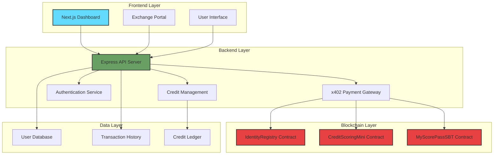

<div align="center">

# 🎯 MyScorePass

### **Decentralized Credit Scoring Infrastructure for Financial Institutions**

[](https://testnet.snowtrace.io/)
[](https://soliditylang.org/)
[](https://nextjs.org/)
[](https://nodejs.org/)
[](https://x402.gitbook.io/x402)

**🏆 Built for Hack2Build: Payments x402 Hackathon**

[Live Demo](#-quick-start) • [Documentation](#-architecture) • [Smart Contracts](#-smart-contracts) • [API Reference](#-api-endpoints)

</div>

---

## 🌟 **Overview**

**MyScorePass** is a revolutionary B2B credit scoring infrastructure that leverages blockchain technology and the x402 payment protocol to provide secure, transparent, and verifiable credit assessments for exchanges, banks, and financial institutions.

### **Key Features**

🔐 **Soulbound Tokens (SBT)** - Non-transferable credit score certifications  
💳 **x402 Payment Protocol** - Seamless micropayments for API access  
🏦 **B2B Infrastructure** - Purpose-built for financial institutions  
⚡ **Avalanche Network** - Fast, low-cost transactions  
🔍 **On-Chain Verification** - Transparent and immutable credit history  
📊 **Prepaid Credit System** - Flexible pay-as-you-go model  

---

## 🎯 **Problem & Solution**

### **The Problem**
Traditional credit scoring systems are:
- ❌ Centralized and opaque
- ❌ Expensive to access for institutions
- ❌ Vulnerable to data manipulation
- ❌ Difficult to verify and audit

### **Our Solution**
MyScorePass provides:
- ✅ **Decentralized identity verification** via blockchain
- ✅ **Transparent scoring** with on-chain proof
- ✅ **Cost-effective access** through x402 micropayments
- ✅ **Immutable certificates** using Soulbound Tokens
- ✅ **B2B API** for seamless integration

---

## 🏗️ **Architecture**



---

## 📦 **Smart Contracts**

Our platform is powered by three core smart contracts deployed on **Avalanche Fuji Testnet**:

### **1. IdentityRegistry** 
📍 [`0x33BC552527f02dc79f7402da2C3641e030280A6e`](https://testnet.snowtrace.io/address/0x33BC552527f02dc79f7402da2C3641e030280A6e)

**Purpose:** Decentralized identity and Proof of Humanity management

**Features:**
- Unique identity creation with document hash storage
- Multi-level verification system (0-3)
- IPFS-ready for document storage
- Admin-controlled verification process

**Key Functions:**
```solidity
createIdentity(string documentHash)
verifyIdentity(address user, uint256 level)
getIdentity(address user)
```

---

### **2. CreditScoringMini**
📍 [`0xeaa5340bFB2f841513f4FBB62Fd72aA0f0621757`](https://testnet.snowtrace.io/address/0xeaa5340bFB2f841513f4FBB62Fd72aA0f0621757)

**Purpose:** On-chain credit score calculation and management

**Features:**
- Initial credit score calculation (300-1000 range)
- Dynamic score adjustments (rewards/penalties)
- Blacklist management for high-risk users
- Maximum loan calculation based on score

**Key Functions:**
```solidity
calculateInitialScore(address user)
getScore(address user)
rewardScore(address user, uint256 reward)
penalizeScore(address user, uint256 penalty)
```

---

### **3. MyScorePassSBT**
📍 [`0x7c931CE29454040c05124c872fdC95570af398f7`](https://testnet.snowtrace.io/address/0x7c931CE29454040c05124c872fdC95570af398f7)

**Purpose:** Soulbound Token for credit score certification

**Features:**
- ERC-721 based non-transferable tokens
- Immutable credit score certification
- Verification level tracking
- One active SBT per user (auto-revoke on update)

**Key Functions:**
```solidity
mintSBT(address to, bytes32 scoreHash, uint256 score, uint256 verificationLevel)
getSBTMetadata(uint256 tokenId)
getUserSBT(address user)
verifySBT(address user, uint256 minVerificationLevel)
```

---

## 🚀 **Quick Start**

### **Prerequisites**

- **Node.js** 18+ or 20+ (recommended)
- **npm** or **yarn**
- **MetaMask** or compatible Web3 wallet
- **Avalanche Fuji Testnet** configured
- **Thirdweb Account** (optional for production x402)

### **Installation**

```bash
# Clone the repository
git clone https://github.com/yourusername/MyScorePass.git
cd MyScorePass

# Install all dependencies
npm install

# Install frontend dependencies
cd frontend
npm install

# Install backend dependencies
cd ../backend
npm install

# Install contract dependencies
cd ../contracts
npm install
```

### **Configuration**

#### **1. Frontend Setup**

```bash
cd frontend
cp .env.example .env.local
```

Edit `frontend/.env.local`:

```env
NEXT_PUBLIC_THIRDWEB_CLIENT_ID=your_thirdweb_client_id
NEXT_PUBLIC_API_URL=http://localhost:3001
NEXT_PUBLIC_CHAIN_ID=43113

# Smart Contract Addresses
NEXT_PUBLIC_IDENTITY_REGISTRY=0x33BC552527f02dc79f7402da2C3641e030280A6e
NEXT_PUBLIC_CREDIT_SCORING=0xeaa5340bFB2f841513f4FBB62Fd72aA0f0621757
NEXT_PUBLIC_SBT_CONTRACT=0x7c931CE29454040c05124c872fdC95570af398f7
```

#### **2. Backend Setup**

```bash
cd backend
cp .env.example .env
```

Edit `backend/.env`:

```env
PORT=3001
JWT_SECRET=your-super-secure-jwt-secret-change-this

# x402 Payment Mode
X402_MODE=simulated  # Use 'production' for real payments

# Smart Contract Addresses
SBT_CONTRACT_ADDRESS=0x7c931CE29454040c05124c872fdC95570af398f7
IDENTITY_REGISTRY_ADDRESS=0x33BC552527f02dc79f7402da2C3641e030280A6e
CREDIT_SCORING_ADDRESS=0xeaa5340bFB2f841513f4FBB62Fd72aA0f0621757

# Merchant Wallet (receives payments)
MERCHANT_WALLET_ADDRESS=0x46ed7979AA91803a429c0871273D94DD45Dbd346

# Optional: Production x402 settings
THIRDWEB_SECRET_KEY=your_thirdweb_secret_key
THIRDWEB_SERVER_WALLET_ADDRESS=your_server_wallet_address
```

### **Running the Application**

```bash
# Terminal 1: Start Backend
cd backend
npm start

# Terminal 2: Start Frontend
cd frontend
npm run dev
```

**Access the application:**
- 🌐 Frontend: http://localhost:3000
- 🔌 Backend API: http://localhost:3001

---

## 🧪 **Testing Guide**

### **Complete User Flow**

#### **Step 1: Register as Exchange**
1. Navigate to http://localhost:3000
2. Click **"Login"** → **"Register"**
3. Fill in the form:
   - **Name:** Binance Test
   - **Email:** test@binance.com
   - **Password:** password123
   - **Wallet Address:** (optional)

#### **Step 2: Purchase Credits via x402**
1. Go to **Dashboard** → **Subscription**
2. Select credit amount (minimum: 10 credits)
3. Click **"Purchase Credits"**
4. System responds with **HTTP 402 Payment Required**
5. Confirm payment (simulated in MVP mode)
6. Credits are automatically added to your balance

**Pricing:**
- 💰 **100 USDC per credit**
- 📦 **Minimum purchase: 10 credits (1,000 USDC)**

#### **Step 3: Query User Database**
1. Go to **Dashboard** → **Users**
2. Apply filters (optional):
   - Credit score range
   - Verification level
   - Name search
3. Click **"Query Users"**
4. **1 credit consumed** per query
5. View detailed user information

#### **Step 4: View Usage History**
1. Go to **Dashboard** → **Usage**
2. Review:
   - Credit purchases
   - Query history
   - Remaining balance

---

## 📡 **API Endpoints**

### **Authentication**

| Method | Endpoint             | Description                 |
| ------ | -------------------- | --------------------------- |
| `POST` | `/api/auth/register` | Register new exchange       |
| `POST` | `/api/auth/login`    | Login and get JWT token     |
| `GET`  | `/api/auth/me`       | Get authenticated user info |

### **Subscriptions (x402 Protected)**

| Method | Endpoint                      | Description             |
| ------ | ----------------------------- | ----------------------- |
| `POST` | `/api/subscriptions/purchase` | Purchase credits (x402) |
| `GET`  | `/api/subscriptions/balance`  | Get credit balance      |
| `GET`  | `/api/subscriptions/usage`    | Get usage history       |

### **User Queries**

| Method | Endpoint               | Description                 |
| ------ | ---------------------- | --------------------------- |
| `GET`  | `/api/mockUsers`       | List users (1 credit)       |
| `GET`  | `/api/mockUsers/:id`   | Get user details (1 credit) |
| `GET`  | `/api/mockUsers/stats` | Database statistics         |

### **Soulbound Tokens**

| Method | Endpoint                      | Description          |
| ------ | ----------------------------- | -------------------- |
| `POST` | `/api/sbt/mint`               | Mint SBT (protected) |
| `GET`  | `/api/sbt/:address`           | Get user's SBT       |
| `GET`  | `/api/sbt/:address/verify`    | Verify SBT           |
| `GET`  | `/api/sbt/stats/total-supply` | Total SBTs issued    |

### **x402 Payment Flow**

**Request without payment:**
```bash
POST /api/subscriptions/purchase
Authorization: Bearer <jwt_token>
Content-Type: application/json

{
  "credits": 10
}
```

**Response (HTTP 402):**
```json
{
  "amount": "1000",
  "currency": "USDC",
  "network": "avalanche-fuji",
  "recipient": "0x46ed7979AA91803a429c0871273D94DD45Dbd346",
  "description": "Purchase 10 credits for user database access",
  "credits": 10,
  "pricePerCredit": 100
}
```

**Retry with payment header:**
```bash
POST /api/subscriptions/purchase
Authorization: Bearer <jwt_token>
X-Payment: <payment_proof>
Content-Type: application/json

{
  "credits": 10
}
```

---

## 💡 **Technical Stack**

### **Frontend**
- ⚛️ **Next.js 14** - React framework with App Router
- 🎨 **Tailwind CSS** - Utility-first styling
- 🔗 **Wagmi** - React hooks for Ethereum
- 🌈 **RainbowKit** - Wallet connection UI
- 📊 **Recharts** - Data visualization

### **Backend**
- 🟢 **Node.js** - JavaScript runtime
- 🚂 **Express.js** - Web framework
- 🔐 **JWT** - Authentication
- 💳 **x402 Middleware** - Payment protocol
- 📝 **JSON Storage** - MVP data persistence

### **Blockchain**
- ⛓️ **Avalanche Fuji** - Testnet deployment
- 📜 **Solidity 0.8.20** - Smart contract language
- 🔨 **Hardhat** - Development environment
- 🔒 **OpenZeppelin** - Security libraries
- 🌐 **Ethers.js** - Blockchain interaction

---

## 🎨 **Features Breakdown**

### **x402 Payment Integration**

The x402 protocol enables seamless micropayments for API access:

- ✅ **HTTP 402 Status Code** - Standard payment required response
- ✅ **Automatic Payment Detection** - Frontend handles payment flow
- ✅ **Flexible Modes** - Simulated (MVP) or Production (real payments)
- ✅ **Thirdweb Integration** - Payment verification via facilitator

### **Credit System**

Prepaid credit model for B2B clients:

- 💰 **Transparent Pricing** - 100 USDC per credit
- 📊 **Usage Tracking** - Complete purchase and consumption history
- ⚡ **Automatic Deduction** - 1 credit per query
- 🔄 **Flexible Top-ups** - Purchase credits anytime

### **Mocked Database**

100 pre-generated users for testing:

- 👤 **Realistic Data** - Names, IDs, emails, wallet addresses
- 📈 **Credit Scores** - Range 300-1000 with realistic distribution
- ✅ **Verification Levels** - 0 (unverified) to 3 (fully verified)
- 🔄 **Regenerable** - Easy to reseed with script

```bash
cd backend
node src/scripts/seedMockUsers.js
```

### **Soulbound Tokens (SBT)**

Non-transferable credit score certificates:

- 🔒 **Non-Transferable** - Cannot be sold or transferred
- 🎯 **One Per User** - Automatic revocation on update
- 📜 **Verifiable** - On-chain proof of credit score
- 🔐 **Immutable** - Permanent record on blockchain

---

## 📊 **Project Status**

### **✅ Implemented Features**

- ✅ Complete authentication system for exchanges
- ✅ x402 payment protocol integration
- ✅ Prepaid credit subscription model
- ✅ User database with 100 mocked entries
- ✅ Credit consumption tracking
- ✅ Full-featured dashboard
### Smart Contracts (Solidity)

- **`MyScorePassSBT`** - Soulbound Token for credit scores with **30-day expiration** 🆕
- **`IdentityRegistry`** - Identity and Proof of Humanity management
- **`CreditScoringMini`** - On-chain credit scoring logic

> **🆕 Recent Improvements:**
> - ✅ **SBT Expiration System** - 30-day validity period for sustainable revenue
> - ✅ **Renewal Functionality** - `renewSBT()` and `renewUserSBT()` functions
> - ✅ **118 Comprehensive Tests** - Full test coverage for all contracts
> - ✅ **Technical Roadmap** - 6-phase plan including ZKPs and dynamic scoring
> 
> See [IMPROVEMENTS.md](./IMPROVEMENTS.md) and [ROADMAP.md](./ROADMAP.md) for details.

## 🏗️ **Architecture Enhancements**

- ⚠️ Real x402 payment verification with Thirdweb facilitator
- ⚠️ PostgreSQL/MongoDB database migration
- ⚠️ IPFS integration for document storage
- ⚠️ Advanced credit scoring algorithms
- ⚠️ Multi-chain support (Ethereum, Polygon)
- ⚠️ API rate limiting and security hardening
- ⚠️ Automated testing suite
- ⚠️ Contract verification on Snowtrace

---

## 🔐 **Security Considerations**

### **Smart Contracts**
- ✅ OpenZeppelin security libraries
- ✅ Owner-only critical functions
- ✅ Reentrancy protection
- ✅ Input validation

### **Backend**
- ✅ JWT authentication
- ✅ Environment variable protection
- ✅ CORS configuration
- ⚠️ Rate limiting (planned)

### **Frontend**
- ✅ Secure wallet connection
- ✅ Client-side validation
- ✅ HTTPS recommended for production

---

## 🤝 **Contributing**

This project was developed for the **Hack2Build: Payments x402 Hackathon** on Avalanche.

We welcome contributions! Please follow these steps:

1. Fork the repository
2. Create a feature branch (`git checkout -b feature/AmazingFeature`)
3. Commit your changes (`git commit -m 'Add some AmazingFeature'`)
4. Push to the branch (`git push origin feature/AmazingFeature`)
5. Open a Pull Request

---

## 📄 **License**

This project is licensed under the MIT License - see the [LICENSE](LICENSE) file for details.

---

## 📚 **Resources**

- 📖 [x402 Protocol Documentation](https://x402.gitbook.io/x402)
- 🏔️ [Avalanche Documentation](https://docs.avax.network/)
- 🌐 [Avalanche Fuji Testnet](https://docs.avax.network/quickstart/fuji-workflow)
- 🔗 [Thirdweb x402 Guide](https://portal.thirdweb.com/x402)
- 🔍 [Snowtrace Explorer](https://testnet.snowtrace.io/)
- 🛠️ [Hardhat Documentation](https://hardhat.org/)

---

## 👥 **Team**

Built with ❤️ for the Avalanche ecosystem

---

## 🙏 **Acknowledgments**

- **Avalanche** - For providing a fast and scalable blockchain platform
- **Thirdweb** - For x402 payment infrastructure
- **OpenZeppelin** - For secure smart contract libraries
- **Hack2Build** - For organizing this amazing hackathon

---

<div align="center">

### **⭐ Star this repository if you find it helpful!**

[](https://github.com/yourusername/MyScorePass)
[](https://github.com/yourusername/MyScorePass/fork)

**Made with 🔥 for Hack2Build: Payments x402 Hackathon**

</div>
