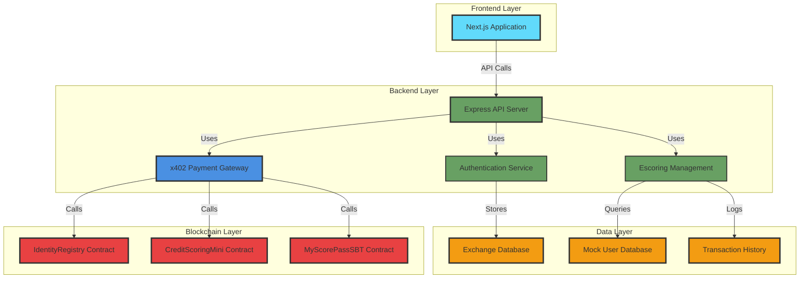

# MyScorePass - Credit Scoring Infrastructure for Exchanges

<div align="center">


### **Decentralized Credit Scoring Infrastructure for Financial Institutions**

**🏆 Built for Hack2Build: Payments x402 Hackathon**

</div>

---

## 🌟 **Overview**

**MyScorePass** is a B2B credit scoring infrastructure that leverages blockchain technology and the x402 payment protocol to provide secure, transparent, and verifiable credit assessments for exchanges, banks, and financial institutions.

This project has been continuously improved and refined through live sessions with professors and mentors, who provided valuable feedback and guidance to enhance the system's architecture, user experience, and technical implementation.

### **Key Features**

🔐 **Privy Authentication** - Email-based login/registration  
💳 **x402 Payment Protocol** - Seamless micropayments for API access  
🏦 **B2B Infrastructure** - Purpose-built for financial institutions  
⚡ **Avalanche Network** - Fast, low-cost transactions  
📊 **Prepaid Credit System** - Flexible pay-as-you-go model  
🔍 **Mock User Database** - 100 pre-generated users for testing  

---

## 🏗️ **Architecture**



---

## 📦 **Smart Contracts**

Deployed on **Avalanche Fuji Testnet** (Chain ID: 43113):

- **IdentityRegistry** - [`0x33BC552527f02dc79f7402da2C3641e030280A6e`](https://testnet.snowtrace.io/address/0x33BC552527f02dc79f7402da2C3641e030280A6e)
- **CreditScoringMini** - [`0xeaa5340bFB2f841513f4FBB62Fd72aA0f0621757`](https://testnet.snowtrace.io/address/0xeaa5340bFB2f841513f4FBB62Fd72aA0f0621757)
- **MyScorePassSBT** - [`0x7c931CE29454040c05124c872fdC95570af398f7`](https://testnet.snowtrace.io/address/0x7c931CE29454040c05124c872fdC95570af398f7)

---

## 🚀 **Quick Start**

### **Prerequisites**

- Node.js 18+
- Wallet (MetaMask, Core Wallet, etc.)
- Avalanche Fuji Testnet configured
- Thirdweb account (for x402 facilitator)

### **Installation**

```bash
# Clone repository
git clone <repo-url>
cd MyScorePass

# Install frontend dependencies
cd frontend
npm install

# Install backend dependencies
cd ../backend
npm install

# Install contract dependencies
cd ../contracts
npm install
```

### **Configuration**

#### **Frontend** (`frontend/.env.local`)

```env
NEXT_PUBLIC_THIRDWEB_CLIENT_ID=your_thirdweb_client_id
NEXT_PUBLIC_API_URL=http://localhost:3001
NEXT_PUBLIC_PRIVY_APP_ID=your_privy_app_id
NEXT_PUBLIC_THIRDWEB_SERVER_WALLET_ADDRESS=your_server_wallet
```

#### **Backend** (`backend/.env`)

```env
PORT=3001
JWT_SECRET=your-super-secure-jwt-secret-change-this

# x402 Payment Configuration
THIRDWEB_SECRET_KEY=your_thirdweb_secret_key
THIRDWEB_SERVER_WALLET_ADDRESS=your_server_wallet_address
```

### **Running**

```bash
# Terminal 1: Backend
cd backend
npm start

# Terminal 2: Frontend
cd frontend
npm run dev
```

**Access:**
- 🌐 Frontend: http://localhost:3000
- 🔌 Backend: http://localhost:3001

---

## 🧪 **User Flow**

### **1. Register/Login**
- Navigate to `/login`
- Sign in with Privy (email-based authentication)
- Account is automatically created if it doesn't exist

### **2. Purchase Credits**
- Go to Dashboard → Subscription
- Select credit amount (minimum: 10 credits = 0.2 USDC)
- Connect wallet to Avalanche Fuji Testnet
- Confirm payment via x402 protocol
- Credits are added to your balance

**Pricing:**
- 💰 **0.02 USDC per credit**
- 📦 **Minimum: 10 credits (0.2 USDC)**

### **3. Query Users**
- Go to Dashboard → Users
- Search users by name, score, or verification level (free)
- Click "View" on any user to see full details (consumes 1 credit)
- View complete user information (Email, Score, Verification Level, Wallet)

### **4. View Usage**
- Go to Dashboard → Usage
- Review purchase history and credit consumption

---

## 📡 **API Endpoints**

### **Authentication**
- `POST /api/auth/privy-login` - Sync Privy user with backend JWT
- `GET /api/auth/me` - Get authenticated user info

### **Subscriptions (x402 Protected)**
- `POST /api/subscriptions/purchase` - Purchase credits (x402)
- `GET /api/subscriptions/balance` - Get credit balance
- `GET /api/subscriptions/usage` - Get usage history

### **User Queries**
- `GET /api/mockUsers/search` - Search users (free, no credits)
- `GET /api/mockUsers/:id` - Get user details (consumes 1 credit)
- `GET /api/mockUsers/stats` - Database statistics

---

## 💡 **Technical Stack**

**Frontend:**
- Next.js 14 (App Router)
- Privy (Authentication)
- Wagmi + RainbowKit (Wallet connection)
- Thirdweb (x402 payments)
- Tailwind CSS

**Backend:**
- Node.js + Express
- JWT Authentication
- x402 Payment Gateway (Thirdweb)
- JSON file storage (MVP)

**Blockchain:**
- Avalanche Fuji Testnet
- Solidity 0.8.20
- Hardhat

---

## 🎨 **Features**

### **x402 Payment Integration**
- HTTP 402 Payment Required response
- Thirdweb facilitator integration
- Automatic payment verification
- Development mode for testing

### **Credit System**
- Prepaid credit model
- Transparent pricing (0.02 USDC/credit)
- Automatic credit consumption
- Complete usage tracking

### **Mock User Database**
- 100 pre-generated users
- Realistic data (names, IDs, emails, wallets)
- Credit scores (300-1000 range)
- Verification levels (0-3)

### **User Search Flow**
- Free search by filters (name, score, verification level)
- Credit consumption only when viewing full user details
- Efficient credit usage model

---

## 📊 **Project Status**

### **✅ Implemented**
- Privy email authentication
- x402 payment protocol integration
- Prepaid credit system
- Mock user database (100 users)
- Free search + paid detail view
- Complete dashboard interface
- Smart contracts deployed

### **⚠️ Future Enhancements**
- Real database migration (PostgreSQL/MongoDB)
- IPFS integration for documents
- Advanced credit scoring algorithms
- Multi-chain support
- API rate limiting

---

## 📚 **TEAM**

- Arturo Marin Bosquet
- Diego Raúl Barrionuevo


---

<div align="center">

**Made with 🔥 for Hack2Build: Payments x402 Hackathon**

</div>
