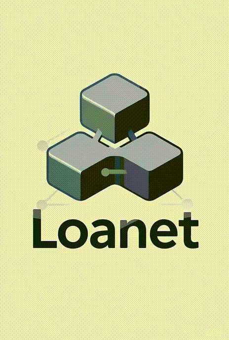

<div align="center">
  
</div>

# Loanet - Plataforma DeFi de Préstamos en Polkadot

Loanet es una plataforma descentralizada de préstamos construida en la testnet Paseo de Polkadot, que ofrece préstamos sin garantía con un sistema integral de scoring crediticio y mecanismos de protección de múltiples niveles.

## 🌐 Red
**Paseo Testnet (Polkadot)**

## 📋 Smart Contracts

### Direcciones de Contratos
- **IdentityRegistry**: `0x18d71DaCd2e657A8babf6C94E0f922C5746E0733`
- https://blockscout-passet-hub.parity-testnet.parity.io/address/0x18d71DaCd2e657A8babf6C94E0f922C5746E0733?tab=index

- **CreditScoring**: `0x345F7F2556EC6480aAa8fCf8deb6CCa202Ed2A14`
- https://blockscout-passet-hub.parity-testnet.parity.io/address/0x345F7F2556EC6480aAa8fCf8deb6CCa202Ed2A14?tab=index

- **LendingPool**: `0x0561eC805C7fbf2392b3353BD5f0920665Ee2b66`
- https://blockscout-passet-hub.parity-testnet.parity.io/address/0x0561eC805C7fbf2392b3353BD5f0920665Ee2b66?tab=index

- **LoanManager**: `0x84A5e36B1619c2333d687615aC40d2C141B00A55`
- https://blockscout-passet-hub.parity-testnet.parity.io/address/0x84A5e36B1619c2333d687615aC40d2C141B00A55?tab=index

- **MockUSDC**: `0x482aAC0Eda23639A4fCd2662E8C67B557e21ef37`
- https://blockscout-passet-hub.parity-testnet.parity.io/address/0x482aAC0Eda23639A4fCd2662E8C67B557e21ef37?tab=index

### ABIs de Contratos
Todos los ABIs de contratos están disponibles en `frontend/config/abis.ts`

### Probar Smart Contracts (TEST)

**🌐 En Producción (Recomendado para jueces):**
- **URL**: `https://frontend-5uwo30gqj-kalchas-projects.vercel.app/test`
- **Acceso**: Botón "Test Contracts" en el dashboard

**💻 En Local (Para desarrollo):**
- **URL**: `http://localhost:3000/test`
- **Requisito**: Ejecutar la aplicación localmente


**📋 Instrucciones de uso Instrucciones para jueces( test  lectura y escritura!)::**

1. **Conectar MetaMask a Paseo Testnet**
2. **Ir a "Test Contracts" en el dashboard (Página de pruebas)**
3. **Probar funciones de lectura y luego escritura(identity Registry)**
4. **Probar funciones de lectura y luego escritura(USDC)**
5. **Probar funciones de lectura y luego escritura(lending Pool -> Aprobar USDC primero y después write)**
6. **Probar funciones de lectura y luego escritura(loan Manager)**


## 🚀 Inicio Rápido

### Prerrequisitos
- Node.js 18+
- Wallet MetaMask
- Paseo testnet configurado en MetaMask

### Instalación
```bash
# Clonar el repositorio
git clone https://github.com/Kalchaqui/DeFiCred-.git
cd DeFiCred

# Instalar dependencias
cd frontend && npm install
cd ../backend && npm install
cd ../contracts && npm install
```

### Ejecutar la Aplicación
```bash
# Iniciar backend
cd backend && npm start

# Iniciar frontend (en otra terminal)
cd frontend && npm run dev
```

## 🏗️ Arquitectura

### Frontend
- **Next.js 14** con App Router
- **Wagmi + RainbowKit** para conexión de wallet
- **Tailwind CSS** para estilos
- **React Hot Toast** para notificaciones

### Backend
- **Node.js + Express** servidor
- **Multer** para subida de archivos
- **CORS** habilitado para peticiones cross-origin

### Smart Contracts
- **Solidity 0.8.0**
- **Hardhat** para desarrollo
- **Polkadot Remix IDE** para despliegue

## 🔧 Características Principales

### Gestión de Identidad
- Subida y verificación de DNI
- Sistema de aprobación por administrador
- Identidad única por wallet

### Scoring Crediticio
- Cálculo de score inicial
- Límites de préstamo basados en score
- Seguimiento de rendimiento

### Sistema de Préstamos
- Préstamos sin garantía
- Planes de pago flexibles (1, 3, 6, 12 meses)
- Tasas de interés: 5%, 8%, 12%, 18% APY

### Sistema de Protección
- **Nivel 1**: Prevención (límites bajos, scoring progresivo)
- **Nivel 2**: Penalización (reducción de score, registro en blockchain)
- **Nivel 3**: Fondo de seguros (2% del monto del préstamo)

## 📱 Flujo de Usuario

1. **Verificación de Identidad**: Subir DNI → Aprobación de administrador
2. **Scoring Crediticio**: Calcular score inicial
3. **Solicitud de Préstamo**: Seleccionar monto y plan de pago
4. **Gestión de Préstamos**: Seguimiento de pagos e historial


### **💻 Acceso Local:**
- **URL**: `http://localhost:3000
- **Requisito**: Ejecutar aplicación localmente


## 🤝 Contribuciones

Este proyecto fue desarrollado para el Latin Hack Hackathon POWERED BY Polkadot. 

**Construido con ❤️ para el ecosistema Polkadot -Diego Raúl Barrionuevo **
